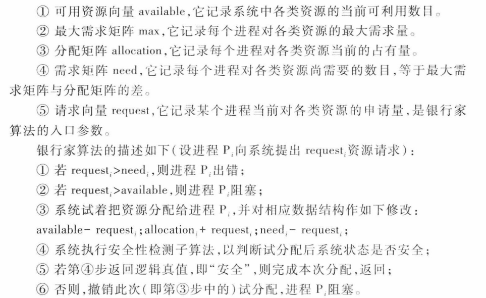
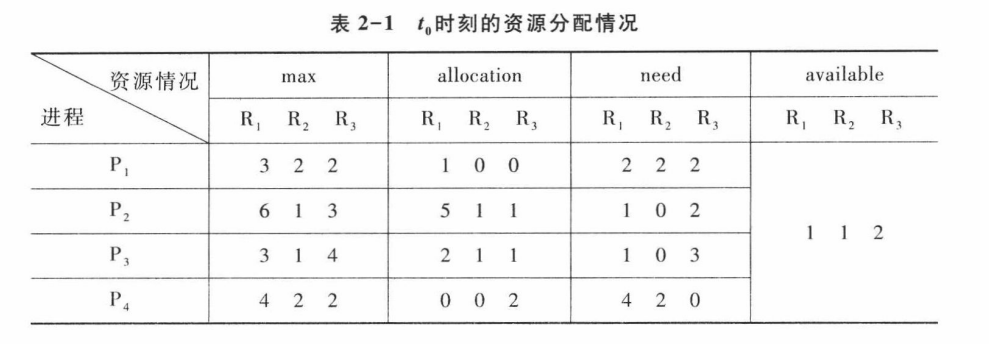
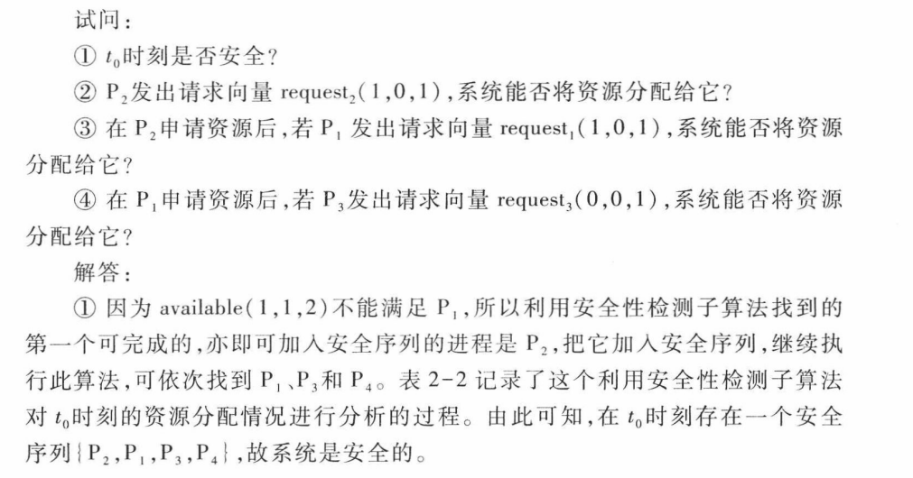
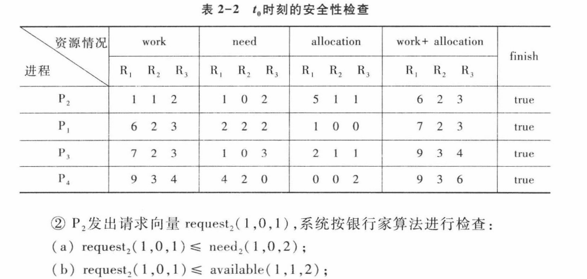
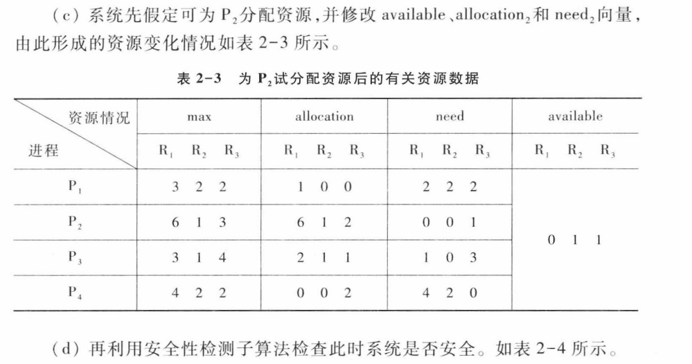
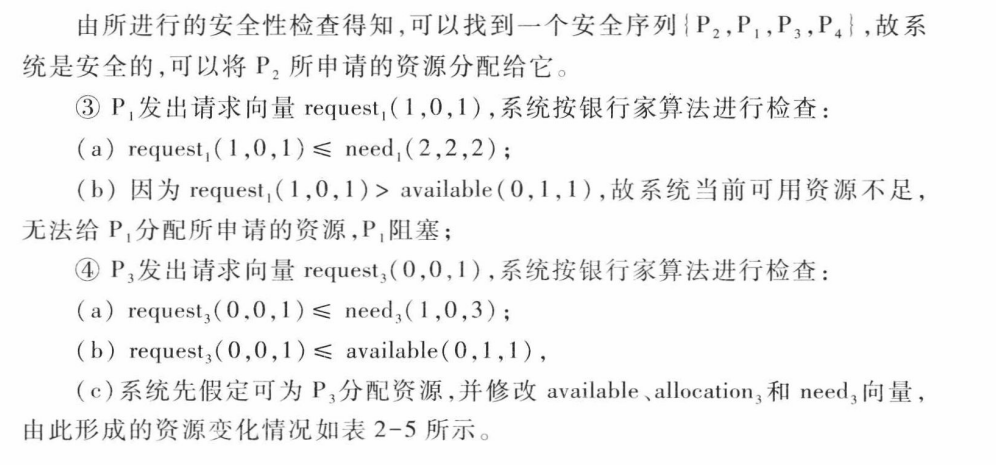
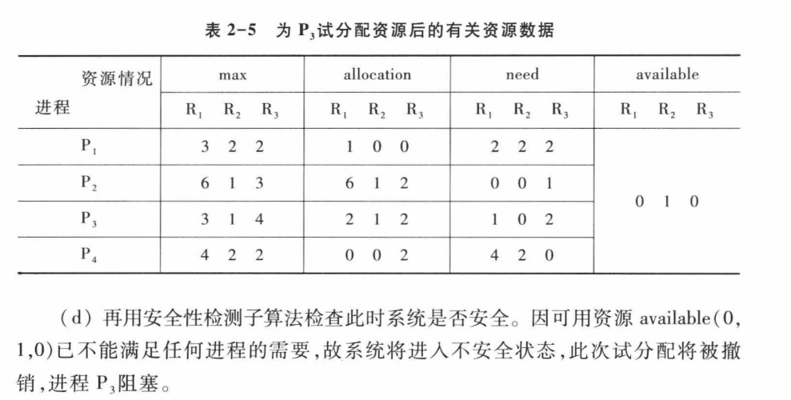

### 避免死锁
#### 1.系统安全状态
处于安全状态下的系统**不可能**发生死锁，处于不安全状态下的系统**可能**发生死锁，可也能通过合理的资源分配避免死锁的发生。 
 
在该方法中，允许进程动态地申请资源，但系统再进行资源分配之前，应先计算此次资源分配的安全性。若此次分配不会导致系统进入不安全状态，才可以将资源分配给进程，否则，进程等待。 
如果不按照安全序列分配资源，则系统可能会由于资源分配不当而进入不安全状态，从而导致死锁的发生。 
#### 2.使用银行家算法避免死锁
为实现银行家算法，每一个新进程在进入系统时，他必须申明在运行过程中可能需要每种资源类型的最大单元数目，其数目不应超过系统所拥有的资源总量。当进程请求一组资源时，系统必须首先确定是否有足够的资源分配给该进程。若有，在进一步计算计算机在将这些资源分配给进程之后，是否会使进程处于不安全状态。如果不会，才将资源分配给他，否则让进程等待。 
**数据结构**
银行家算法的执行有个前提条件，即要求进程预先提出自己的最大资源请求，并假设系统拥有固定的资源总量。下面介绍银行家算法所用的主要的数据结构。 
 
**安全性算法**
描述： 
* 工作向量work：表示系统可提供给进程继续运行所需的各类资源数目，它的初值等于可用资源数目available。
* finish: 表示系统是否有足够的资源分配给进程，使之运行完成，它的初值为false。若有足够的资源分配给进程时，将其值改为true。
 

**具体实例**
假定操作系统中的4个进程P1、P2、P3、P4和3类资源R1、R2、R3(资源数量分别为9、3、6)，在t0时刻的资源分配情况如表2-1： 

**测试代码**
 
[-- 安全性算法代码 --](../code/安全性算法.cpp)