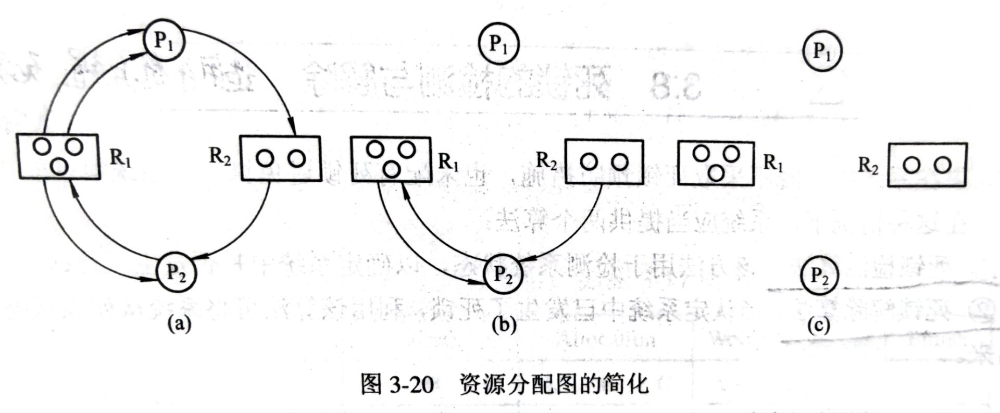

## 死锁的检测与解除
如果在系统中，既不采用死锁预防措施，又不采用死锁避免算法，系统就很可能会死锁。 
在此条件下，系统必须针对这一问题提供两个算法： 
- 死锁检测算法
- 死锁解除算法
  
### 死锁的检测
#### 资源分配图
资源分配图由结点和边组成，构成简单，操作易懂。 
每次拆分一个结点，将能够分配资源的结点运行后拆除边。 
然后反复如此，直至分配图只剩下孤立结点则说明没有死锁。 
否则，拆除不了所有的边，则说明有死锁。 
**拆分过程：** 

#### 死锁检测的数据结构
类似银行家算法，暂时没有了解，不在此展开。 

### 死锁的解除
常用的两种方法是： 
- 抢占资源
- 终止或撤销进程
#### 终止进程
终止所有死锁进程 
逐个终止进程 
#### 付出代价最小的死锁解除算法
暂未深入了解 
最小代价为：  
R(S)min = min{Cui} + min(Cuj) + min(Cuk) + ...  